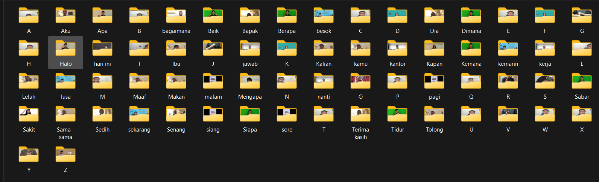
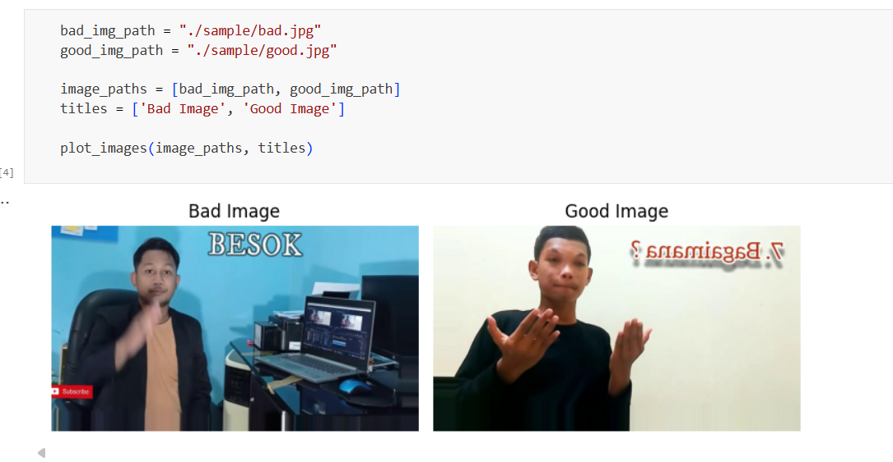
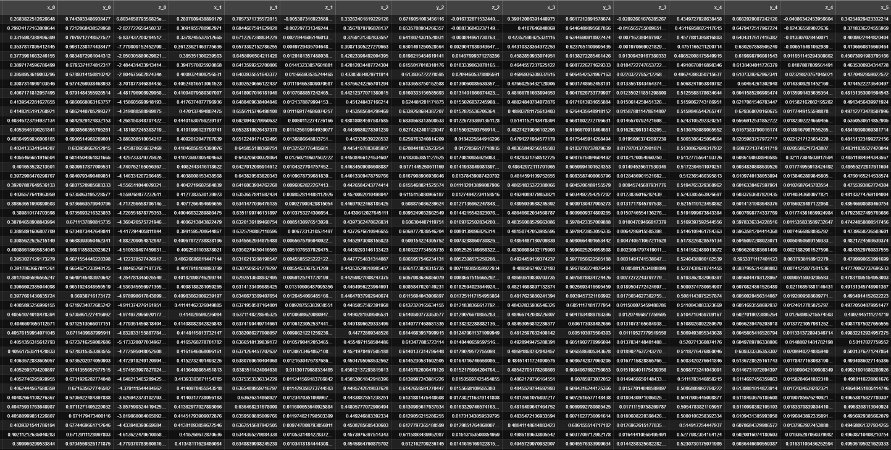
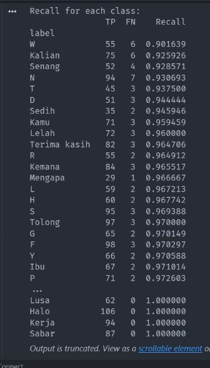
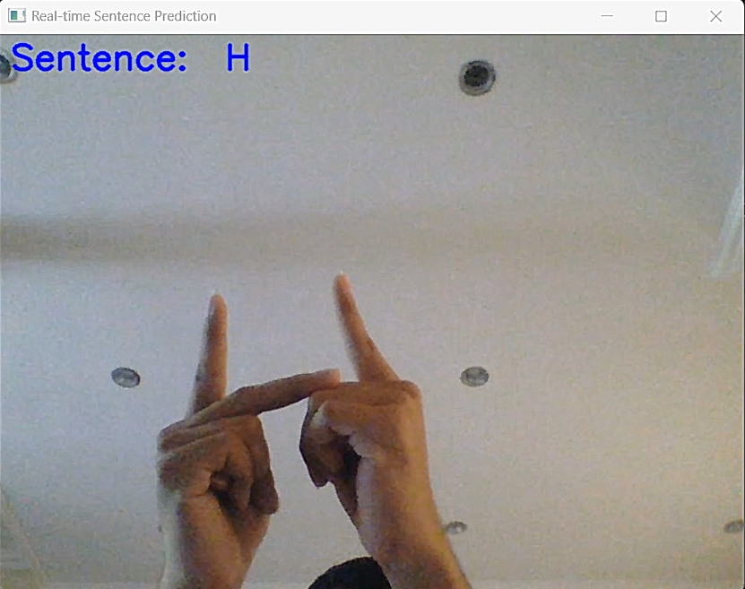
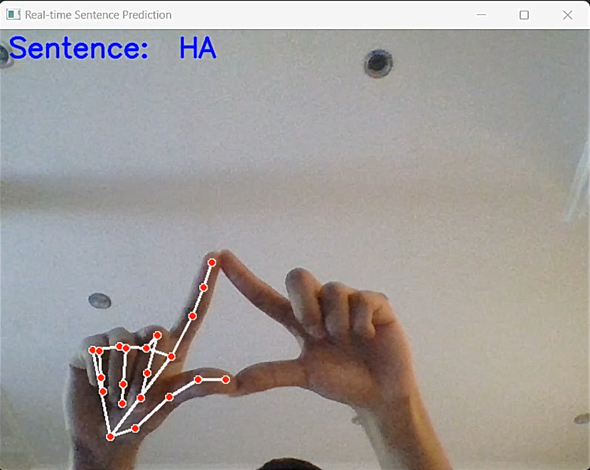
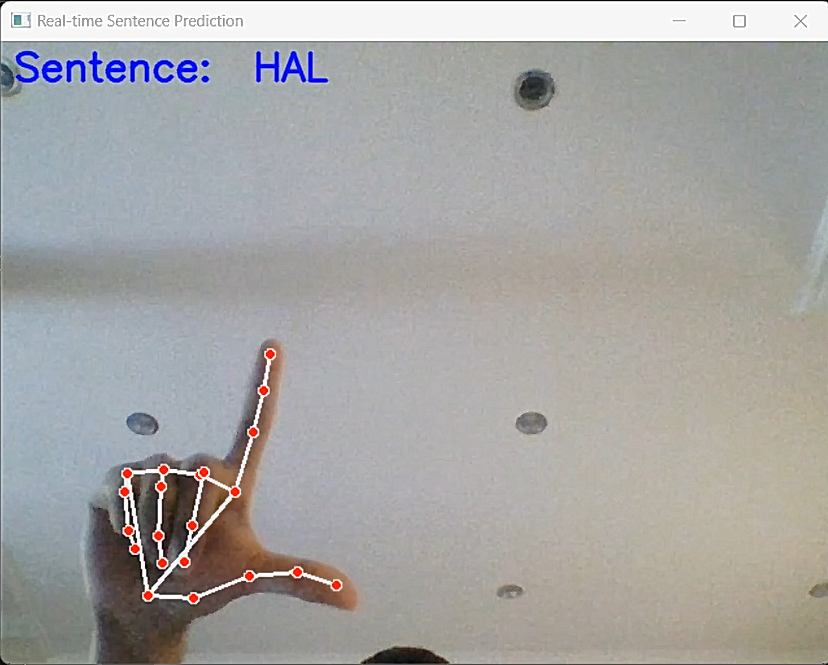
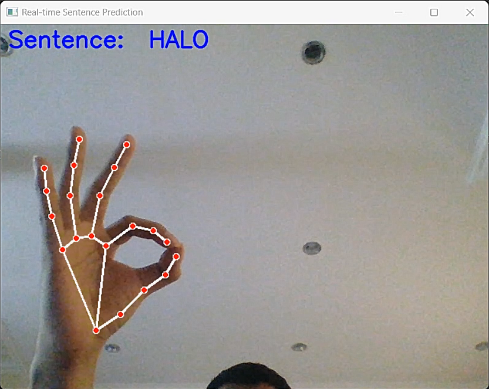
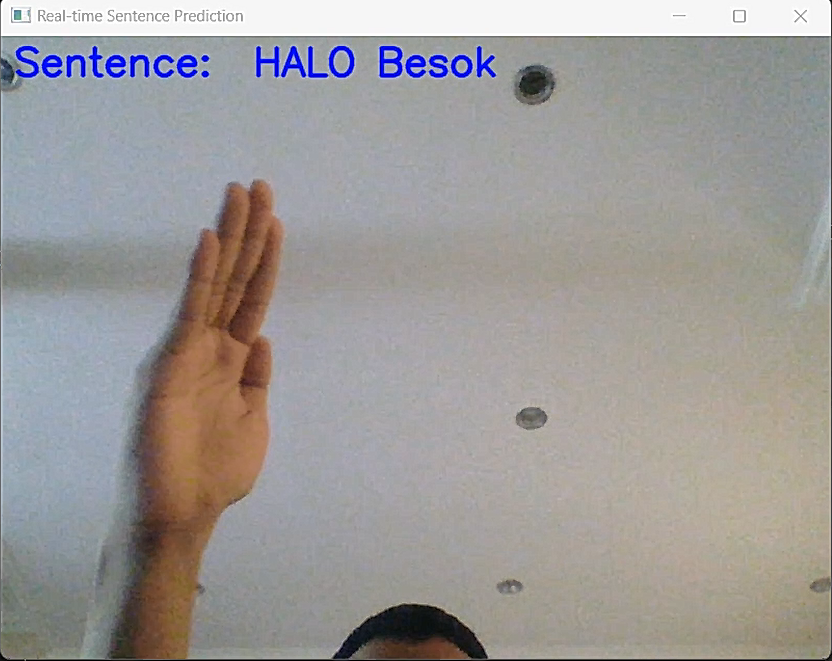
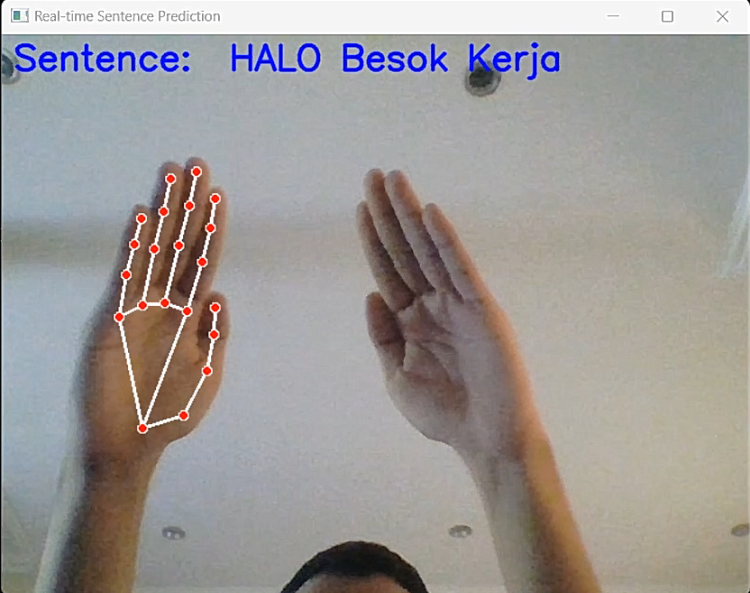

# Hand Sign Detection Project

## Overview
This project focuses on detecting hand signs using machine learning. The data for this project was collected through self-recordings and few selected YouTube videos. The main steps involved in the project are data collection, preprocessing, feature extraction, and training a Deep Neural Network (DNN) model.

## Data Collection

- **Self-recordings**: We recorded videos of ourselves performing various hand signs.
- **YouTube videos**: We sourced additional videos from YouTube to increase the diversity and volume of our dataset.

from both source we get a total of images of 23,102 images and total of 66 Labels that can be used for training model with 14,207 image of words handsign and 8,895 images of alphabet Handsign.

Word Hand sign labels : 
``````SQL
[Jawab, Sore, Bagaimana, Siang, Sekarang, Pagi, Nanti, Malam, Lusa, Kerja, Kemarin, Kantor, Hari Ini, Besok, Aku, Bapak, Dia, Ibu, Kalian, Kamu, Lelah, Maaf, Makan, sama, sedih, senang, terima kasih, Tolong, Apa, Baik, Berapa, Halo, Dimana, Kapan, Kemana, Mengapa, Sabar, Sakit, Siapa, Tidur]
``````
Alphabet Hand sign labels : A - Z 

## Preprocessing
We used the Mediapipe library to preprocess the video frames/images and extract hand landmarks.

### Data Cleaning and Filtering
Before image datasets get processed by mediapipe for feature extration we do some cleaning process by filtering image that cannot be detected by mediapipe such ad no hands detected or missmatch landmarks position. We done the filtering by code and also manually filtering. bellow are the example of good image and bad image.



### Mediapipe Hand Landmarks
Mediapipe is an open-source framework that provides machine learning solutions for live and streaming media. We used the Mediapipe Hands solution to detect and track hand landmarks.

#### Hand Landmarks Extraction
1. **Frame Extraction**: Video frames were extracted using OpenCV.
2. **Landmark Detection**: Each frame was processed to detect 21 hand landmarks per hand, resulting in a total of 42 landmarks for both hands.
3. **Feature Vector**: Each landmark has x, y, and z coordinates, resulting in a total of 126 coordinate features (42 landmarks * 3 coordinates).




### Standardization
To ensure the features are on a similar scale, we applied standard scaling. This step helps in minimizing the max and min range of the coordinate values.

## Model Training
We used a Deep Neural Network (DNN) for training the model with the standardized hand landmark coordinates.

### Deep Neural Network (DNN)
The DNN model was designed to classify different hand signs based on the 126 coordinate features extracted from the hand landmarks.

## Results
After training, the model was evaluated on a test dataset to determine its accuracy in classifying hand signs. The evaluation metrics include Confussion Matrix and recall.



### Real-time Prediction
After testing on real-time the model gave good result and able to detect hand sign language in real-time.








## Conclusion
This project demonstrates the use of machine learning for hand sign detection using video data. The combination of Mediapipe for feature extraction and DNN for classification provides a robust approach to recognizing hand signs.

## How to use this Project

1. First you need to reorganize the image dataset to follow the dataset folder structure bellow.
   Your_Dataset_Folder
   ``````Shell
   |--Folder_Label_A
           |----- image1.png
           |----- image2.png
           ...
           |----- image99.png
   |--Folder_Label_B
           |----- image1.png
           |----- image2.png
           ...
           |----- image99.png
   ...
   |--Folder_Label_Z
           |----- image1.png
           |----- image2.png
           ...
           |----- image99.png
   ``````
   
## Future Work
- **Data Augmentation**: Increase the dataset with more diverse hand signs and different lighting conditions.
- **Model Optimization**: Experiment with different architectures and hyperparameters to improve model performance.
- **Feature Extraction Optimization**: Experiment with different Landmarks Feature Extraction process to improve model performance.

## References
- [Mediapipe Documentation](https://google.github.io/mediapipe/)
- [TensorFlow Documentation](https://www.tensorflow.org/api_docs)

## Acknowledgments
- All contributors and developers of the Mediapipe and TensorFlow libraries.
- Video creators on YouTube for providing valuable data resources.
